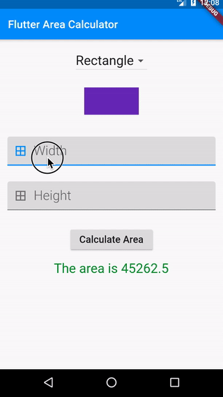

# Simple Flutter Area Calculator

A simple area calculator for rectangle and triangle shapes. Also paints the selected shapes.

## App Layout

## Getting Started

This project is a starting point for a Flutter application.

## What I implemented
- area calculator for rectangle and triangle
- input fields
- custom painting

A few resources to get you started if this is your first Flutter project:

- [Lab: Write your first Flutter app](https://flutter.dev/docs/get-started/codelab)
- [Cookbook: Useful Flutter samples](https://flutter.dev/docs/cookbook)

By alexxsanya@gmail.com under lessons by [Simone Alessandria](https://github.com/simoales)